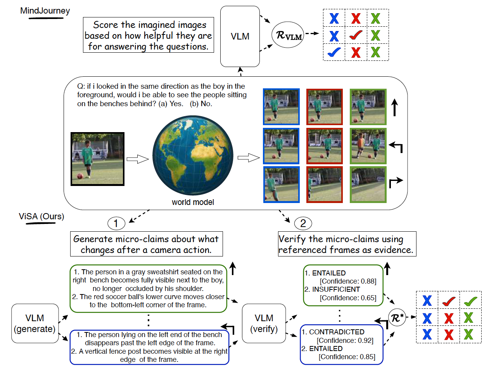

# ViSA for MindJourney

<div align="center">

## 🎉 **Accepted to World Modeling Workshop** 🎉

[](https://world-model-mila.github.io)
[]()

**✨ Verification through Spatial Assertion (ViSA) ✨**

</div>

---

This is the code for our **World Modeling Workshop** paper. Verification through Spatial Assertion (ViSA) extends the [MindJourney](https://github.com/UMass-Embodied-AGI/MindJourney/tree/main) spatial reasoning pipeline with a **Vision-Language Model (VLM) Verifier** that implements a proposer-solver approach. The verifier adds a layer of consistency checking to ensure that generated world model outputs are reliable and accurate.

## Pipeline Overview



The figure above illustrates two pipelines:

- **MindJourney (Top)**: The original pipeline that uses a world model to generate imagined camera views and scores them based on helpfulness for answering spatial reasoning questions.

- **ViSA (Bottom)**: Our extension that adds verification by generating micro-claims about scene changes and verifying them against the imagined frames.

## ViSA Approach

The ViSA verifier enhances the MindJourney pipeline through a **two-step verification process**:

### 1. Micro-Claim Generation
After each camera action, the system:
- Compares the "before" and "after" images from the world model
- Generates **frame-indexed micro-claims** describing expected changes (e.g., "A red mug appears behind the box in frames 6-9")
- Creates claims about spatial relationships, object properties, and dynamic scene changes

### 2. Claim Verification
For each micro-claim:
- Uses a VLM to verify the claim against the visual evidence
- Outputs a verdict: **ENTAILED** (claim is true), **CONTRADICTED** (claim is false), or **INSUFFICIENT** (cannot determine)
- Provides confidence scores and reasoning for each verification

### 3. Score Weighting
The verification results are used to:
- Compute **Claim-Acceptance Rate (CAR)** from verified micro-claims
- Derive **Evidence Quality (EQ)** score from CAR, which measures the reliability of generated world model outputs
- Weight action scores based on Evidence Quality
- Filter out inconsistent or unreliable action results
- Boost scores for actions with high Evidence Quality

This zero-training approach uses off-the-shelf VLMs (GPT-4V, LLaVA, InternVL3) to add quality control and improve the reliability of spatial reasoning.

## Running the Pipelines

### Prerequisites

1. **Environment Setup**: Follow the original MindJourney setup instructions
2. **VLM Configuration**: 
   - For **GPT-family models** (gpt-4o, gpt-4.1, etc.): Set your Azure OpenAI API key and endpoint
     ```bash
     export AZURE_OPENAI_API_KEY="your_api_key"
     ```
     Update `utils/api.py` with your Azure endpoint.
   - For **InternVL3 models**: Ensure adequate VRAM (see resource requirements below) and install required dependencies.

3. **Python Path**: Add the repository root to your Python path
   ```bash
   export PYTHONPATH=$PYTHONPATH:./
   export WORLD_MODEL_TYPE="svc"
   ```

4. **Resource Requirements**: The example SLURM scripts (e.g., `pipeline_svc_cfg_SAT_scaling_spatial_beam_search_slurm.sh`, `pipeline_baseline_slurm.sh`) provide guidance on resource requirements:
   - **GPUs**: 2x 80GB GPUs (e.g., A100) recommended for InternVL3-14B and world model inference
   - **CPU**: 4 cores per task
   - **Memory**: 70GB RAM
   - **Time**: 24 hours for full evaluation runs
   
   Adjust these based on your specific model choices and dataset size.

### 1. Random Pipeline

Runs a random baseline without any intelligent action selection:

```bash
python pipelines/random_with_log_probs.py \
    --input_dir data/SAT \
    --output_dir outputs/random \
    --vlm_model_name "OpenGVLab/InternVL3-14B" \
    --num_questions 10 \
    --split "val"
```

### 2. Baseline Pipeline (No Test-Time Scaling)

Runs the baseline pipeline without world model exploration - directly answers questions from the initial image:

```bash
bash scripts/pipeline_baseline.sh
```

Or directly:

```bash
python pipelines/pipeline_baseline.py \
    --input_dir data/SAT \
    --output_dir outputs/baseline \
    --vlm_model_name "OpenGVLab/InternVL3-14B" \
    --num_questions 10 \
    --split "val" \
    --max_images 1
```

### 3. MindJourney Pipeline (Test-Time Scaling)

Runs the original MindJourney pipeline with spatial beam search using the world model:

```bash
bash scripts/pipeline_svc_SAT_scaling_spatial_beam_search.sh
```

Or directly:

```bash
python pipelines/pipeline_svc_scaling_spatial_beam_search_basic.py \
    --input_dir data/SAT \
    --output_dir outputs/mindjourney \
    --vlm_model_name "OpenGVLab/InternVL3-14B" \
    --num_questions 10 \
    --split "val" \
    --max_steps_per_question 3 \
    --num_beams 3 \
    --num_top_candidates 5
```

### 4. ViSA Pipeline (MindJourney + Verification)

Runs the enhanced pipeline with ViSA verifier enabled:

```bash
bash scripts/pipeline_svc_SAT_scaling_spatial_beam_search_with_verifier.sh
```

Or directly:

```bash
python pipelines/pipeline_svc_scaling_spatial_beam_search_with_verifier.py \
    --enable_verifier \
    --verification_threshold 0.7 \
    --input_dir data/SAT \
    --output_dir outputs/svc_with_verifier \
    --vlm_model_name "OpenGVLab/InternVL3-14B" \
    --num_questions 10 \
    --split "val" \
    --max_steps_per_question 3 \
    --num_beams 3 \
    --num_top_candidates 5
```

**Key ViSA Parameters:**
- `--enable_verifier`: Enable/disable ViSA verifier (default: True)
- `--verification_threshold`: Evidence Quality (EQ) threshold derived from CAR for score weighting (default: 0.7)
- `--baseline`: Run in baseline mode without verifier

## Output Format

The ViSA pipeline includes verification metrics in the results, including Evidence Quality (EQ) derived from Claim Acceptance Rate (CAR):

```json
{
  "accuracy": {...},
  "progress": {...},
  "verification_metrics": {
    "question_id": {
      "step_0": {
        "action_family": {
          "subaction": {
            "claim_acceptance_rate": 0.85,
            "evidence_quality_score": 0.85,
            "consistency_score": 0.85,
            "total_claims": 3,
            "accepted_claims": 2,
            "rejected_claims": 1,
            "claims": [...],
            "verification_results": [...]
          }
        }
      }
    }
  }
}
```

## Citation

This code extends the original MindJourney framework. If you use this repository, please cite:

```bibtex
@misc{yang2025mindjourneytesttimescalingworld,
      title={MindJourney: Test-Time Scaling with World Models for Spatial Reasoning}, 
      author={Yuncong Yang and Jiageng Liu and Zheyuan Zhang and Siyuan Zhou and Reuben Tan and Jianwei Yang and Yilun Du and Chuang Gan},
      year={2025},
      eprint={2507.12508},
      archivePrefix={arXiv},
      primaryClass={cs.CV},
      url={https://arxiv.org/abs/2507.12508}, 
}
```